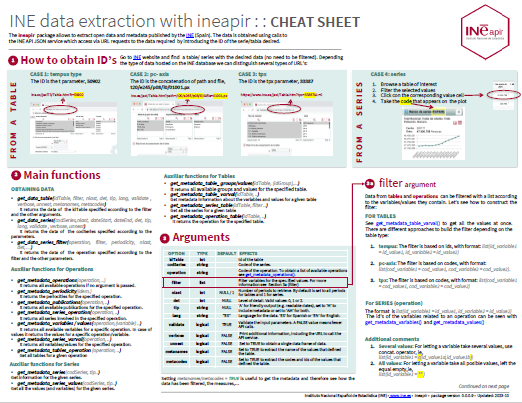

<!-- README.md is generated from README.Rmd. Please edit that file -->

```{r, include = FALSE}
knitr::opts_chunk$set(
  collapse = TRUE,
  comment = "#>",
  fig.path = "man/figures/README-",
  out.width = "100%"
)
```

# ineapir 

<!-- badges: start -->
[](https://github.com/es-ine/ineapir/actions/workflows/R-CMD-check.yaml)
<!-- badges: end -->

## Overview

ineapir provides a set of functions to obtain open data and metadata published
by the National Statistics Institute of Spain 
([INE](https://www.ine.es/en/index.htm)). The data is obtained thanks to calls
to the INE API service which allows access via URL requests to the
available statistical information published by INE.

## Installation

To install the development version of **ineapir** from GitHub.

```{r, eval = FALSE}
remotes::install_github("es-ine/ineapir")
```

Alternatively, you can download the source code as a zip file and
then install it as follows.

```{r, eval = FALSE}
remotes::install_local(path = "path/to/file.zip")
```


## Cheatsheet

<a href="https://raw.githubusercontent.com/es-ine/ineapir/main/man/figures/ineapir.pdf"></a>

## Data request examples

The data is only associated with the series object and these can be grouped
together into statistical tables. The field named '*Valor*' is the only one 
that contains data. The rest of the fields are necessary for the data to be
well defined.

### Obtaining data from a table

To get all the data of a table it is necessary to pass the `idTable`
argument, which is the identification code of the table, to the function
`get_data_table()`.

```{r table_data}
library(ineapir)

# We use the function get_data_table with the argument idTable
# and the argument tip = 'A' for a more friendly output
table <- get_data_table(idTable = 50902, tip = "A")

# Each row represents a series
table[1,c("COD", "Nombre")]

# The Data column contains a data frame for each row with the values 
# of the different periods of each series
head(table$Data[[1]])

# We can concatenate all data frames into one using unnest = TRUE
table <- get_data_table(idTable = 50902, tip = "A", unnest = TRUE)
head(table[,c("COD", "Nombre", "Fecha", "Valor")])
```

To get the last n data from a table it is necessary to pass the `nlast`
argument as well.

```{r table_data_n}
# We use the function get_data_table with arguments idTable and nlast
table <- get_data_table(idTable = 50902, nlast = 2)
table[1,c("COD", "Nombre")]
head(table$Data[[1]])
```

### Obtaining data from a series

To get the last data of a series it is necessary to pass the `codSeries`
argument, which is the identification code of the series, to the function
`get_data_series()`.

```{r series_data}
# We use the function get_data_series with the argument codSeries
series <- get_data_series(codSeries = "IPC251856", tip = "A")
series$Data
```

To get the last n data from a series it is necessary to pass the `nlast`
argument as well.

```{r series_data_n}
# We use the function get_data_series with arguments codSeries and nlast
series <- get_data_series(codSeries = "IPC251856", tip = "A", nlast = 5)
series$Data

# Using unnest = TRUE
series <- get_data_series(codSeries = "IPC251856", tip = "A", nlast = 5,
                          unnest = TRUE)
head(series[,c("COD", "Nombre", "Fecha", "Valor")])
```

Additionally, it is possible to obtain data from a series between two dates.
The date must have and specific format (*yyyy/mm/dd*). If the end date is not
specified we obtain all the data from the start date.

```{r series_data_date}
# We use the function get_data_series with arguments codSeries, dateStart and dataEnd
series <- get_data_series(codSeries = "IPC251856", dateStart = "2023/01/01", 
                          dateEnd = "2023/04/01")
series$Data
```

## Metadata request examples

Structural metadata are objects that describe both time series and statistical
tables and allow their definition. All these database objects have an
associated identifier that is essential for the correct use of the service.

### Obtaining statistical operations

The database contains information about all short-term statistical operations,
those with a periodicity for disseminating results of less than a year, 
as well as some structural statistical operations. We can get all the operations
using the function `get_metadata_operations()`.

```{r operations}
# We use the function get_metadata_operations
operations <- get_metadata_operations()
head(operations)
```

An operation can be identify by a numerical code ('*Id*'), an alphabetic code
('*Codigo*') or by the code of the statistical operation in the Inventory of
Statistical Operations (IOE + '*Cod_IOE*'). To obtain information about only
one operation we have to pass the `operation` argument with one of these codes.

```{r operation}
# We use the function get_metadata_operations with argument operation
operation <- get_metadata_operations(operation = "IPC")
as.data.frame(operation)
```

### Obtaining variables

We can get all the variables of the system using the function
`get_metadata_variables()`.

```{r variables}
# We use the function get_metadata_variables
variables <- get_metadata_variables()
head(variables)
```

A variable can be identify by a numerical code ('*Id*'). In addition, if we
pass the `operation` argument we obtain the variables used in an operation.

```{r variables_opertation}
# We use the function get_metadata_variables with argument operation,
# e.g., operation code = 'IPC'
variables <- get_metadata_variables(operation = "IPC")
head(variables)
```

### Obtaining values

To get all the values that a variable can take it is necessary to pass the
`variable` argument, which is the identifier of the variable, to the function
`get_metadata_values()`.

```{r values}
# We use the function get_metadata_values with argument variable,
# e.g., id = 3 (variable 'Tipo de dato')
values <- get_metadata_values(variable = 3)
head(values)
```

A value can be identify by a numerical code ('*Id*'). In addition, if we pass
the `operation` argument as well we obtain the values that the variable takes
in that particular operation.

```{r values_operation}
# We use the function get_metadata_values with arguments operation and variable,
# e.g., operation code = 'IPC'
values <- get_metadata_values(operation = "IPC", variable = 3)
head(values)
```

### Obtaining tables

We can get the tables associated with an statistical operation using the
function `get_metadata_tables_operation()`.

```{r tables}
# We use the function get_metadata_tables with argument operation
tables <- get_metadata_tables_operation(operation = "IPC")
head(tables[,c("Id","Nombre")])
```

A table is defined by different groups or selection combo boxes and each of
them by the values that one or several variables take. To obtain the
variables and values present in a table first we have to query the groups
that define the table using the function `get_metadata_table_groups()`.

```{r groups}
# We use the function get_metadata_table_groups with argument idTable
groups <- get_metadata_table_groups(idTable = 50902)
head(groups)
```

Once we have the identification codes of the groups, we can query the values
for an specific group using the function `get_metadata_table_values()`.

```{r group_values}
# We use the function get_metadata_table_values with arguments idTable and idGroup
values <- get_metadata_table_values(idTable = 50902, idGroup = 110889)
head(values, 4)
```

Alternatively, we can use the `get_metadata_table_varval()` function to get
the variables and values present in a table.

```{r table_varval}
# Using the function get_metadata_table_varval
values <- get_metadata_table_varval(idTable = 50902)
head(values, 4)
```

### Obtaining series

The data is only associated with the series object. To obtain information
about a particular series it is necessary to pass the `codSeries` argument, 
which is the identification code of the series, to the function
`get_metadata_series()`.

```{r series}
# We use the function get_metadata_series with argument codSeries
series <- get_metadata_series(codSeries = "IPC251856")
as.data.frame(series)
```

To get the values and variables that define a series it is necessary to pass
the `codSeries` argument as well.

```{r series_values}
# We use the function get_metadata_series_values with argument codSeries
values <- get_metadata_series_values(codSeries = "IPC251856")
head(values)
```

To get all the series that define a table it is necessary to pass the
`idTable` argument, which is the identification code of the table, to the
function `get_metadata_series_table()`.

```{r series_table}
# We use the function get_metadata_series_table with argument idTable
series <- get_metadata_series_table(idTable = 50902)
head(series[,c("COD", "Nombre")], 4)
```
