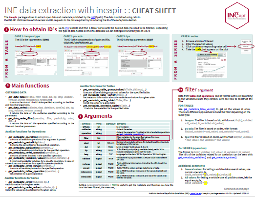

<!-- README.md is generated from README.Rmd. Please edit that file -->

# ineapir 

<!-- badges: start -->
<!-- badges: end -->

## Overview

ineapir provides a set of functions to obtain open data and metadata
published by the National Statistics Institute of Spain
([INE](https://www.ine.es/en/index.htm)). The data is obtained thanks to
calls to the INE API service which allows access via URL requests to the
available statistical information published by INE.

## Installation

To install the development version of **ineapir** you can download the
source code as a zip file and then install it as follows.

``` r
remotes::install_local(path = "path/to/file.zip")
```

Alternatively, for public repositories or in case you have a personal
access token (only for private repositories).

``` r
remotes::install_github("inedifusion/ineapir")
```

## Cheatsheet

<a href="https://raw.githubusercontent.com/inedifusion/ineapir/main/man/figures/ineapir.pdf"></a>

## Data request examples

The data is only associated with the series object and these can be
grouped together into statistical tables. The field named ‘*Valor*’ is
the only one that contains data. The rest of the fields are necessary
for the data to be well defined.

### Obtaining data from a table

To get all the data of a table it is necessary to pass the `idTable`
argument, which is the identification code of the table, to the function
`get_data_table()`.

``` r
library(ineapir)

# We use the function get_data_table with the argument idTable
# and the argument tip = 'A' for a more friendly output
table <- get_data_table(idTable = 50902, tip = "A")

# Each row represents a series
table[1,c("COD", "Nombre")]
#>         COD                                   Nombre
#> 1 IPC251852 Total Nacional. Índice general. Índice.

# The Data column contains a data frame for each row with the values 
# of the different periods of each series
head(table$Data[[1]])
#>                           Fecha T3_TipoDato T3_Periodo Anyo   Valor
#> 1 2024-03-01T00:00:00.000+01:00  Definitivo        M03 2024 114.674
#> 2 2024-02-01T00:00:00.000+01:00  Definitivo        M02 2024 113.807
#> 3 2024-01-01T00:00:00.000+01:00  Definitivo        M01 2024 113.404
#> 4 2023-12-01T00:00:00.000+01:00  Definitivo        M12 2023 113.308
#> 5 2023-11-01T00:00:00.000+01:00  Definitivo        M11 2023 113.280
#> 6 2023-10-01T00:00:00.000+02:00  Definitivo        M10 2023 113.676

# We can concatenate all data frames into one using unnest = TRUE
table <- get_data_table(idTable = 50902, tip = "A", unnest = TRUE)
head(table[,c("COD", "Nombre", "Fecha", "Valor")])
#>           COD                                   Nombre
#> 1   IPC251852 Total Nacional. Índice general. Índice. 
#> 1.1 IPC251852 Total Nacional. Índice general. Índice. 
#> 1.2 IPC251852 Total Nacional. Índice general. Índice. 
#> 1.3 IPC251852 Total Nacional. Índice general. Índice. 
#> 1.4 IPC251852 Total Nacional. Índice general. Índice. 
#> 1.5 IPC251852 Total Nacional. Índice general. Índice. 
#>                             Fecha   Valor
#> 1   2024-03-01T00:00:00.000+01:00 114.674
#> 1.1 2024-02-01T00:00:00.000+01:00 113.807
#> 1.2 2024-01-01T00:00:00.000+01:00 113.404
#> 1.3 2023-12-01T00:00:00.000+01:00 113.308
#> 1.4 2023-11-01T00:00:00.000+01:00 113.280
#> 1.5 2023-10-01T00:00:00.000+02:00 113.676
```

To get the last n data from a table it is necessary to pass the `nlast`
argument as well.

``` r
# We use the function get_data_table with arguments idTable and nlast
table <- get_data_table(idTable = 50902, nlast = 2)
table[1,c("COD", "Nombre")]
#>         COD                                   Nombre
#> 1 IPC251852 Total Nacional. Índice general. Índice.
head(table$Data[[1]])
#>          Fecha FK_TipoDato FK_Periodo Anyo   Valor Secreto
#> 1 1.709248e+12           1          3 2024 114.674   FALSE
#> 2 1.706742e+12           1          2 2024 113.807   FALSE
```

### Obtaining data from a series

To get the last data of a series it is necessary to pass the `codSeries`
argument, which is the identification code of the series, to the
function `get_data_series()`.

``` r
# We use the function get_data_series with the argument codSeries
series <- get_data_series(codSeries = "IPC251856", tip = "A")
series$Data
#>                           Fecha T3_TipoDato T3_Periodo Anyo Valor
#> 1 2024-03-01T00:00:00.000+01:00  Definitivo        M03 2024   3.2
```

To get the last n data from a series it is necessary to pass the `nlast`
argument as well.

``` r
# We use the function get_data_series with arguments codSeries and nlast
series <- get_data_series(codSeries = "IPC251856", tip = "A", nlast = 5)
series$Data
#>                           Fecha T3_TipoDato T3_Periodo Anyo Valor
#> 1 2023-11-01T00:00:00.000+01:00  Definitivo        M11 2023   3.2
#> 2 2023-12-01T00:00:00.000+01:00  Definitivo        M12 2023   3.1
#> 3 2024-01-01T00:00:00.000+01:00  Definitivo        M01 2024   3.4
#> 4 2024-02-01T00:00:00.000+01:00  Definitivo        M02 2024   2.8
#> 5 2024-03-01T00:00:00.000+01:00  Definitivo        M03 2024   3.2

# Using unnest = TRUE
series <- get_data_series(codSeries = "IPC251856", tip = "A", nlast = 5,
                          unnest = TRUE)
head(series[,c("COD", "Nombre", "Fecha", "Valor")])
#>           COD                                            Nombre
#> 1   IPC251856 Total Nacional. Índice general. Variación anual. 
#> 1.1 IPC251856 Total Nacional. Índice general. Variación anual. 
#> 1.2 IPC251856 Total Nacional. Índice general. Variación anual. 
#> 1.3 IPC251856 Total Nacional. Índice general. Variación anual. 
#> 1.4 IPC251856 Total Nacional. Índice general. Variación anual. 
#>                             Fecha Valor
#> 1   2023-11-01T00:00:00.000+01:00   3.2
#> 1.1 2023-12-01T00:00:00.000+01:00   3.1
#> 1.2 2024-01-01T00:00:00.000+01:00   3.4
#> 1.3 2024-02-01T00:00:00.000+01:00   2.8
#> 1.4 2024-03-01T00:00:00.000+01:00   3.2
```

Additionally, it is possible to obtain data from a series between two
dates. The date must have and specific format (*yyyy/mm/dd*). If the end
date is not specified we obtain all the data from the start date.

``` r
# We use the function get_data_series with arguments codSeries, dateStart and dataEnd
series <- get_data_series(codSeries = "IPC251856", dateStart = "2023/01/01", 
                          dateEnd = "2023/04/01")
series$Data
#>          Fecha FK_TipoDato FK_Periodo Anyo Valor Secreto
#> 1 1.672528e+12           1          1 2023   5.9   FALSE
#> 2 1.675206e+12           1          2 2023   6.0   FALSE
#> 3 1.677625e+12           1          3 2023   3.3   FALSE
#> 4 1.680300e+12           1          4 2023   4.1   FALSE
```

## Metadata request examples

Structural metadata are objects that describe both time series and
statistical tables and allow their definition. All these database
objects have an associated identifier that is essential for the correct
use of the service.

### Obtaining statistical operations

The database contains information about all short-term statistical
operations, those with a periodicity for disseminating results of less
than a year, as well as some structural statistical operations. We can
get all the operations using the function `get_metadata_operations()`.

``` r
# We use the function get_metadata_operations
operations <- get_metadata_operations()
head(operations)
#>   Id Cod_IOE                                                 Nombre Codigo  Url
#> 1  4   30147           Estadística de Efectos de Comercio Impagados     EI <NA>
#> 2  6   30211                     Índice de Coste Laboral Armonizado   ICLA <NA>
#> 3  7   30168 Estadística de Transmisión de Derechos de la Propiedad   ETDP <NA>
#> 4 10   30256                                    Indicadores Urbanos     UA <NA>
#> 5 13   30219                Estadística del Procedimiento Concursal    EPC <NA>
#> 6 14   30182                Índices de Precios del Sector Servicios    IPS <NA>
```

An operation can be identify by a numerical code (‘*Id*’), an alphabetic
code (‘*Codigo*’) or by the code of the statistical operation in the
Inventory of Statistical Operations (IOE + ‘*Cod_IOE*’). To obtain
information about only one operation we have to pass the `operation`
argument with one of these codes.

``` r
# We use the function get_metadata_operations with argument operation
operation <- get_metadata_operations(operation = "IPC")
as.data.frame(operation)
#>   Id Cod_IOE                             Nombre Codigo
#> 1 25   30138 Índice de Precios de Consumo (IPC)    IPC
```

### Obtaining variables

We can get all the variables of the system using the function
`get_metadata_variables()`.

``` r
# We use the function get_metadata_variables
variables <- get_metadata_variables()
head(variables)
#>    Id                           Nombre Codigo
#> 1 349            Totales Territoriales    NAC
#> 2 954                            Total       
#> 3  70 Comunidades y Ciudades Autónomas   CCAA
#> 4 955       Cultivos, pastos y huertos       
#> 5 115                       Provincias   PROV
#> 6 956              SAU y Otras tierras
```

A variable can be identify by a numerical code (‘*Id*’). In addition, if
we pass the `operation` argument we obtain the variables used in an
operation.

``` r
# We use the function get_metadata_variables with argument operation,
# e.g., operation code = 'IPC'
variables <- get_metadata_variables(operation = "IPC")
head(variables)
#>    Id                           Nombre Codigo
#> 1   3                     Tipo de dato       
#> 2  70 Comunidades y Ciudades Autónomas   CCAA
#> 3 115                       Provincias   PROV
#> 4 269           Grupos especiales 2001       
#> 5 270                    Rúbricas 2001       
#> 6 349            Totales Territoriales    NAC
```

### Obtaining values

To get all the values that a variable can take it is necessary to pass
the `variable` argument, which is the identifier of the variable, to the
function `get_metadata_values()`.

``` r
# We use the function get_metadata_values with argument variable,
# e.g., id = 3 (variable 'Tipo de dato')
values <- get_metadata_values(variable = 3)
head(values)
#>   Id Fk_Variable                                                   Nombre
#> 1 70           3                                             Datos brutos
#> 2 71           3 Datos corregidos de efectos estacionales y de calendario
#> 3 72           3                                                Dato base
#> 4 73           3                                     Variación trimestral
#> 5 74           3                                          Variación anual
#> 6 75           3                                                    Euros
#>   Codigo
#> 1       
#> 2       
#> 3       
#> 4       
#> 5       
#> 6
```

A value can be identify by a numerical code (‘*Id*’). In addition, if we
pass the `operation` argument as well we obtain the values that the
variable takes in that particular operation.

``` r
# We use the function get_metadata_values with arguments operation and variable,
# e.g., operation code = 'IPC'
values <- get_metadata_values(operation = "IPC", variable = 3)
head(values)
#>   Id Fk_Variable            Nombre Codigo
#> 1 72           3         Dato base       
#> 2 74           3   Variación anual       
#> 3 83           3            Índice       
#> 4 84           3 Variación mensual       
#> 5 85           3       Media anual      M
#> 6 86           3   Variación anual
```

### Obtaining tables

We can get the tables associated with an statistical operation using the
function `get_metadata_tables_operation()`.

``` r
# We use the function get_metadata_tables with argument operation
tables <- get_metadata_tables_operation(operation = "IPC")
head(tables[,c("Id","Nombre")])
#>      Id                                                                 Nombre
#> 1 24077                    Índice general nacional. Series desde enero de 1961
#> 2 25331                             Ponderaciones: general y de grupos ECOICOP
#> 3 35083        Índices nacionales: Componentes para el análisis de la COVID-19
#> 4 49130                        Índices nacionales: general y de grupos ECOICOP
#> 5 50902                        Índices nacionales: general y de grupos ECOICOP
#> 6 50908 Índices nacionales a impuestos constantes: general y de grupos ECOICOP
```

A table is defined by different groups or selection combo boxes and each
of them by the values that one or several variables take. To obtain the
variables and values present in a table first we have to query the
groups that define the table using the function
`get_metadata_table_groups()`.

``` r
# We use the function get_metadata_table_groups with argument idTable
groups <- get_metadata_table_groups(idTable = 50902)
head(groups)
#>       Id         Nombre
#> 1 110889 Grupos ECOICOP
#> 2 110890   Tipo de dato
```

Once we have the identification codes of the groups, we can query the
values for an specific group using the function
`get_metadata_table_values()`.

``` r
# We use the function get_metadata_table_values with arguments idTable and idGroup
values <- get_metadata_table_values(idTable = 50902, idGroup = 110889)
head(values, 4)
#>       Id Fk_Variable                             Nombre Codigo
#> 1 304092         762                     Índice general     00
#> 2 304093         762 Alimentos y bebidas no alcohólicas     01
#> 3 304094         762       Bebidas alcohólicas y tabaco     02
#> 4 304095         762                  Vestido y calzado     03
#>   FK_JerarquiaPadres
#> 1               NULL
#> 2             304092
#> 3             304092
#> 4             304092
```

Alternatively, we can use the `get_metadata_table_varval()` function to
get the variables and values present in a table.

``` r
# Using the function get_metadata_table_varval
values <- get_metadata_table_varval(idTable = 50902)
head(values, 4)
#>       Id Fk_Variable                             Nombre Codigo
#> 1 304092         762                     Índice general     00
#> 2 304093         762 Alimentos y bebidas no alcohólicas     01
#> 3 304094         762       Bebidas alcohólicas y tabaco     02
#> 4 304095         762                  Vestido y calzado     03
```

### Obtaining series

The data is only associated with the series object. To obtain
information about a particular series it is necessary to pass the
`codSeries` argument, which is the identification code of the series, to
the function `get_metadata_series()`.

``` r
# We use the function get_metadata_series with argument codSeries
series <- get_metadata_series(codSeries = "IPC251856")
as.data.frame(series)
#>       Id       COD FK_Operacion
#> 1 251856 IPC251856           25
#>                                              Nombre Decimales FK_Periodicidad
#> 1 Total Nacional. Índice general. Variación anual.          1               1
#>   FK_Publicacion FK_Clasificacion FK_Escala FK_Unidad
#> 1              8               90         1       135
```

To get the values and variables that define a series it is necessary to
pass the `codSeries` argument as well.

``` r
# We use the function get_metadata_series_values with argument codSeries
values <- get_metadata_series_values(codSeries = "IPC251856")
head(values)
#>       Id Fk_Variable          Nombre Codigo
#> 1  16473         349  Total Nacional     00
#> 2 304092         762  Índice general     00
#> 3     74           3 Variación anual
```

To get all the series that define a table it is necessary to pass the
`idTable` argument, which is the identification code of the table, to
the function `get_metadata_series_table()`.

``` r
# We use the function get_metadata_series_table with argument idTable
series <- get_metadata_series_table(idTable = 50902)
head(series[,c("COD", "Nombre")], 4)
#>         COD                                                          Nombre
#> 1 IPC251852                        Total Nacional. Índice general. Índice. 
#> 2 IPC251855             Total Nacional. Índice general. Variación mensual. 
#> 3 IPC251856               Total Nacional. Índice general. Variación anual. 
#> 4 IPC251858 Total Nacional. Índice general. Variación en lo que va de año.
```
