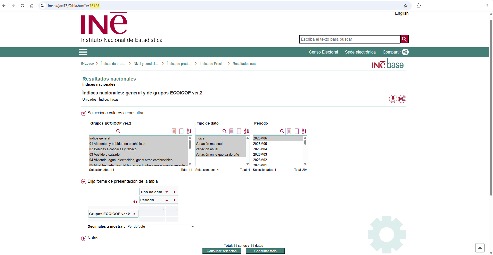
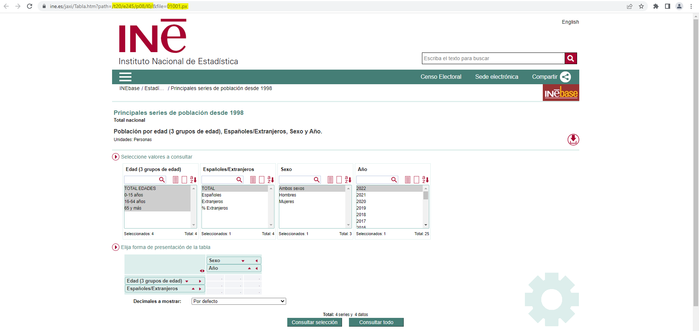
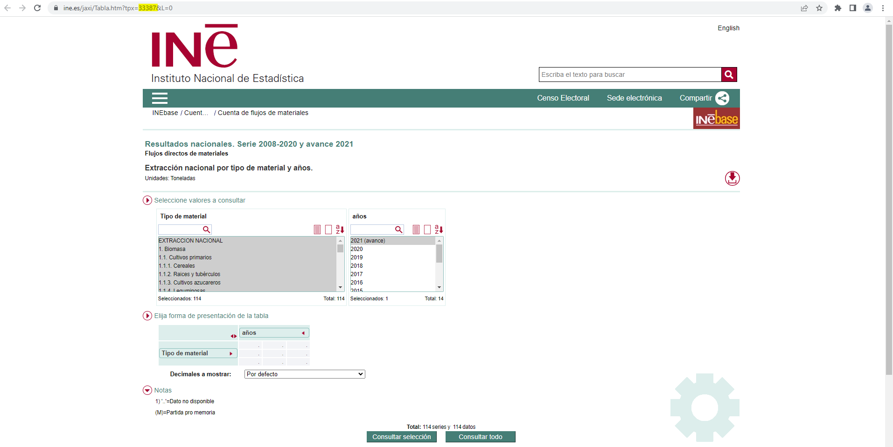
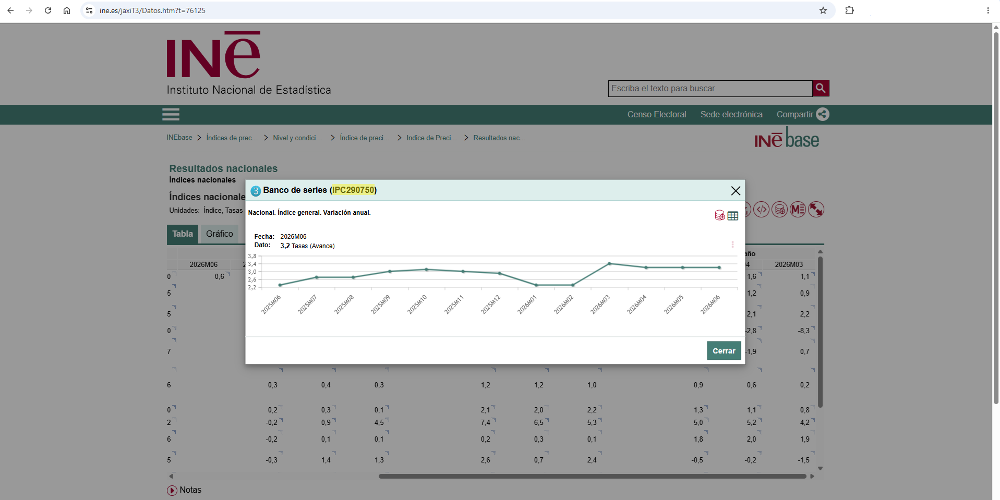

# How to identify the codes of tables and series on the INE website

This article is aim to help identify the codes of tables and series on
the INE website that are necessary to perform data queries.

## Obtaining the identification code of a table

When browsing to a table, there are three possible cases when it comes
to identifying its ID.

**REMARK:** The id of a table is unique and immutable, no matter what
variables/values have been selected in the table.

### Case one

- **URL:** <https://www.ine.es/jaxiT3/Tabla.htm?t=76125>
- **ID:** URL *t* parameter **76125**



Identification code of a Tempus table

``` r

library(ineapir)
# Request table data with id = 76125
table <- get_data_table(idTable = 76125, nlast = 1, unnest = TRUE)
table[1:2,c("Nombre", "FK_Periodo", "Anyo", "Valor")]
#>                                          Nombre FK_Periodo Anyo Valor
#> 2 Nacional. Índice general. Variación mensual.           6 2026   0.6
#> 3   Nacional. Índice general. Variación anual.           6 2026   3.2
```

### Case two (pc-axis file)

- **URL:**
  <https://www.ine.es/jaxi/Tabla.htm?path=/t20/e245/p08/l0/&file=01001.px>
- **ID:** concatenate URL parameters *path* and *file* into one single
  ID **t20/e245/p08/l0/01001.px**



Identification code of a px table

``` r

# Request table data with id = t20/e245/p08/l0/01001.px
table <- get_data_table(idTable = "t20/e245/p08/l0/01001.px", nlast = 1, unnest = TRUE)
head(table, 3)
#>                             Nombre NombrePeriodo    Valor Secreto
#> 1 TOTAL EDADES, TOTAL, Ambos sexos          2022 47475420   FALSE
#> 2     TOTAL EDADES, TOTAL, Hombres          2022 23265381   FALSE
#> 3     TOTAL EDADES, TOTAL, Mujeres          2022 24210039   FALSE
```

### Case three (tpx file)

- **URL:** <https://www.ine.es/jaxi/Tabla.htm?tpx=33387&L=0>
- **ID:** URL *tpx* parameter **33387**



Identification code of a tpx table

``` r

# Request table data with id = 33387
table <- get_data_table(idTable = 33387, nlast = 1, unnest = TRUE)
head(table, 3)
#>                     Nombre NombrePeriodo     Valor Secreto
#> 1      EXTRACCION NACIONAL 2024 (avance) 371995244   FALSE
#> 2              1.  Biomasa 2024 (avance) 126108212   FALSE
#> 3 1.1.  Cultivos primarios 2024 (avance)  67456391   FALSE
```

## Obtaining the identification code of a series

The tables introduced in cases two and three not include temporal
series. Only tables from case one contain temporal series. In order to
obtain the identification code of a series it is necessary to carry out
a number of steps.

1.  Browse to a [table](https://www.ine.es/jaxiT3/Tabla.htm?t=76125)
    containing the series of interest.
2.  Make the selection of values in the table and perform the query.
3.  Click on the corresponding value cell.
4.  The pop-up window shows, among other information, the identification
    code of the series associated with the cell that was clicked on.



Identification code of a Tempus series

``` r

# Request series data with code = IPC290750
serie <- get_data_series(codSeries = "IPC290750", unnest = TRUE)
serie[1,c("Nombre", "FK_Periodo", "Anyo", "Valor")]
#>                                        Nombre FK_Periodo Anyo Valor
#> 1 Nacional. Índice general. Variación anual.           6 2026   3.2
```
