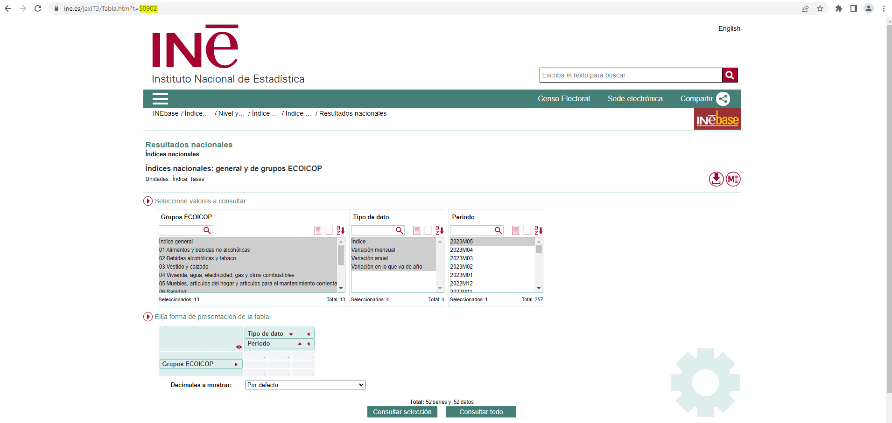
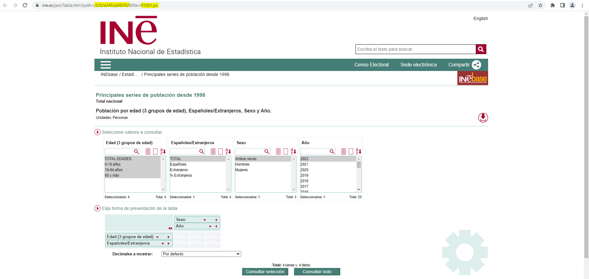
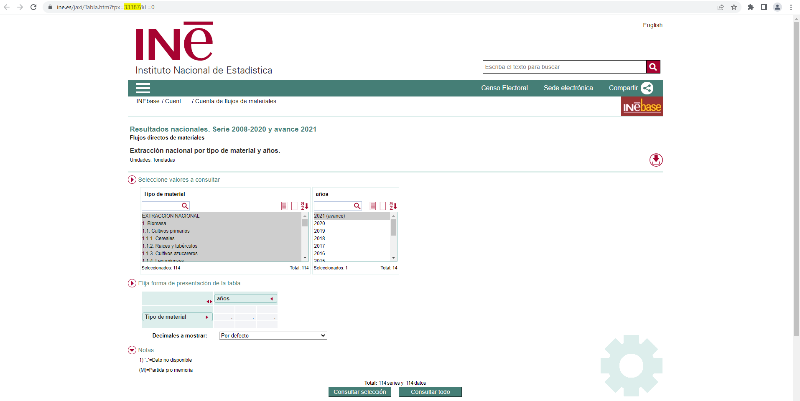
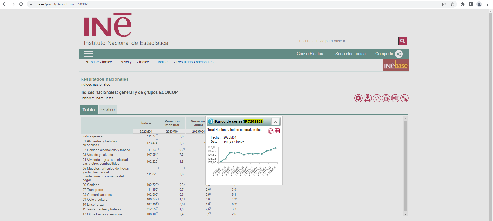

```{r, include = FALSE}
knitr::opts_chunk$set(
  collapse = TRUE,
  comment = "#>"
)
```


This article is aim to help identify the codes of tables and series on the INE
website that are necessary to perform data queries.

## Obtaining the identification code of a table

When browsing to a table, there are three possible cases when it comes to
identifying its ID.

**REMARK:** The id of a table is unique and immutable, no matter what variables/values
 have been selected in the table.
 
### Case one

- **URL:** https://www.ine.es/jaxiT3/Tabla.htm?t=50902
- **ID:** URL *t* parameter **50902**

{width=100%}

```{r table_data_1}
library(ineapir)
# Request table data with id = 50902
table <- get_data_table(idTable = 50902, nlast = 1, unnest = TRUE)
table[1:2,c("Nombre", "FK_Periodo", "Anyo", "Valor")]
```

### Case two (pc-axis file)
- **URL:** https://www.ine.es/jaxi/Tabla.htm?path=/t20/e245/p08/l0/&file=01001.px
- **ID:** concatenate URL parameters *path* and *file* into one single ID
  **t20/e245/p08/l0/01001.px**

{width=100%}

```{r table_data_2}
# Request table data with id = t20/e245/p08/l0/01001.px
table <- get_data_table(idTable = "t20/e245/p08/l0/01001.px", nlast = 1, unnest = TRUE)
head(table, 3)
```


### Case three (tpx file)

- **URL:** https://www.ine.es/jaxi/Tabla.htm?tpx=33387&L=0
- **ID:** URL *tpx* parameter **33387**

{width=100%}

```{r table_data_3}
# Request table data with id = 33387
table <- get_data_table(idTable = 33387, nlast = 1, unnest = TRUE)
head(table, 3)
```

## Obtaining the identification code of a series

The tables introduced in cases two and three not include temporal series. Only
tables from case one contain temporal series. In order to obtain the 
identification code of a series it is necessary to carry out a number of steps.

1. Browse to a [table](https://www.ine.es/jaxi/Tabla.htm?path=/t20/e245/p08/l0/&file=01001.px)
containing the series of interest. 
2. Make the selection of values in the table and perform the query.
3. Click on the corresponding value cell.
4. The pop-up window shows, among other information, the identification code of
the series associated with the cell that was clicked on.

{width=100%}

```{r serie_data_1}
# Request series data with code = IPC251856
serie <- get_data_series(codSeries = "IPC251856", unnest = TRUE)
serie[1,c("Nombre", "FK_Periodo", "Anyo", "Valor")]
```
